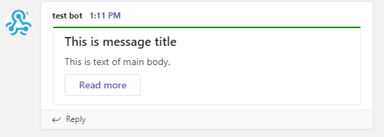
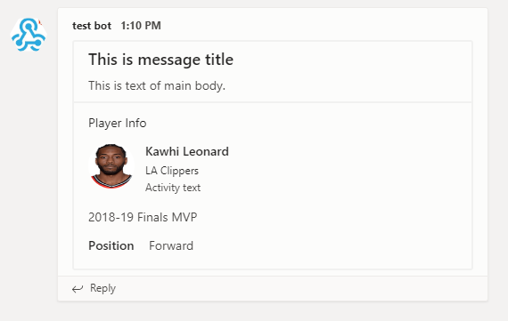
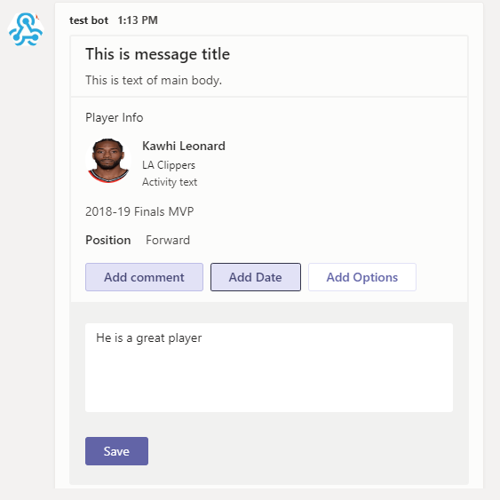

<!-- README.md is generated from README.Rmd. Please edit that file -->

# teamr

<!-- badges: start -->
[](https://travis-ci.com/wwwjk366/teamr)
[](https://cran.r-project.org/package=teamr)
<!-- badges: end -->


-----

The goal of teamr is to provide a wrapper library to send messages to
Microsoft Teams through connectors(incoming webhooks)

## Installation

You can install the released version of teamr from
[CRAN](https://CRAN.R-project.org) with:

``` r
install.packages("teamr")
```

And the development version from [GitHub](https://github.com/) with:

``` r
# install.packages("devtools")
devtools::install_github("wwwjk366/teamr")
```

## Example

This is a basic example of send a simple titled message to MS Teams:

``` r
library(teamr)

# initiate new connector card object
cc <- connector_card$new(hookurl = "https://outlook.office.com/...")
# add text
cc$text("This is text of main body.")
# add title
cc$title("This is message title")
# add hyperlink button
cc$add_link_button("Read more", "https://www.google.com")
# change theme color
cc$color("#008000")
# print out the payload for checking
cc$print()
#> Card: 
#>   hookurl: https://outlook.office.com/webhook/...
#>   payload:  {"text":"This is text of main body.","title":"This is message title","potentialAction":[{"@context":"http://schema.org","@type":"ViewAction","name":"Read more","target":["https://www.google.com"]}],"themeColor":"#008000"}
# send to Teams
cc$send()
#> [1] TRUE
```



## Message with sections

``` r
# initiate new connector card object
cc <- connector_card$new(hookurl = "https://outlook.office.com/...")

# add text
cc$text("This is text of main body.")
# add title
cc$title("This is message title")
# initiate a new section
sec <- card_section$new()

sec$text(sec_text = "2018-19 Finals MVP")
sec$add_fact(fname = "Position", fvalue = "Forward")
sec$title(sec_title = "Player Info")
sec$activity_image(sec_activitiy_image = "https://d2cwpp38twqe55.cloudfront.net/req/201905091/images/players/leonaka01.jpg")
sec$activity_title(sec_activity_title = "Kawhi Leonard")
sec$activity_sub_title(sec_activitiy_subtitle = "LA Clippers")
sec$activity_text(sec_activitiy_text = "Activity text")
cc$add_section(new_section = sec)
cc$send()
#> [1] TRUE
```



## Message with action cards

``` r
# create new action card
pa <- action_card$new(type = "ActionCard", name = "Add comment")
# add default actions to card
pa$add_actions()
# add text inputs
pa$add_text_inputs(id = "comment", title = "Add comment for this task", is_multi_line = TRUE)
# save to the card object
cc$add_potential_action(pa)

pa2 <- action_card$new(type = "ActionCard", name = "Add Date")
pa2$add_actions()
pa2$add_date_inputs(id = "date", title = "Add Date for this task")
cc$add_potential_action(pa2)

pa3 <- action_card$new(type = "ActionCard", name = "Add Options")
pa3$add_actions()
# add multiple choices. note that choices must be a nested named list
pa3$add_mchoice_inputs(id = "mchoice", 
                       title = "Choice one", 
                       is_multi_select = TRUE, 
                       choices = list(
                         list(display="In Progress", value=1),
                         list(display="Active", value=2),
                         list(display="Close", value=3))
                       )
cc$add_potential_action(pa3)

cc$send()
#> [1] TRUE
```


